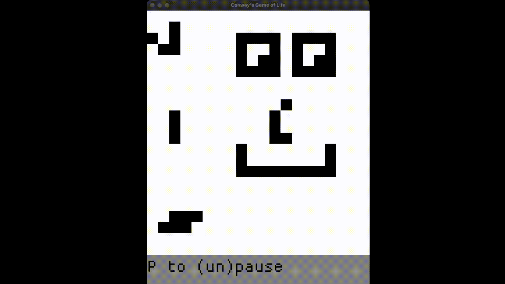

# Conway's game of life
Simple implementation of [Conway's Game of life](https://en.wikipedia.org/wiki/Conway%27s_Game_of_Life), using the [macroquad](https://github.com/not-fl3/macroquad).

Here's a demonstration of the project (This is a gif, not a still image. It takes some time to start).


## Installation instructions
Follow this instructions in order.

### Clone the repositiory into your machine

This command will clone the repository into in a directory named CGOL (short for Conway's Game Of Life). 

```shell
git clone git@github.com:lima-limon-inc/Conways-game-of-life.git CGOL/
```

### Compile the project

Enter the previously created directory and compile the project. Like so: 
``` shell
cd CGOL/
make build
```

### Run the project 

Now for the fun part, run the project! 

Simply enter in your terminal:

``` shell
make run
```

